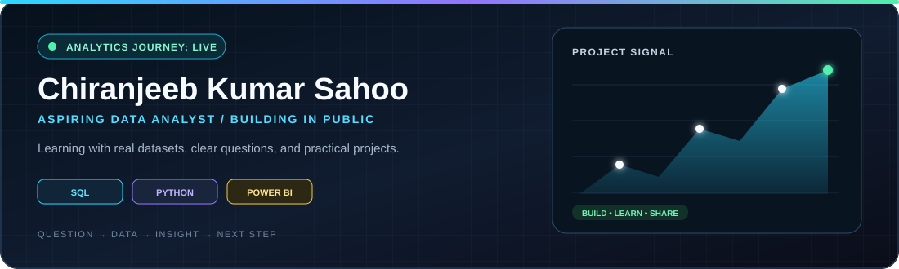
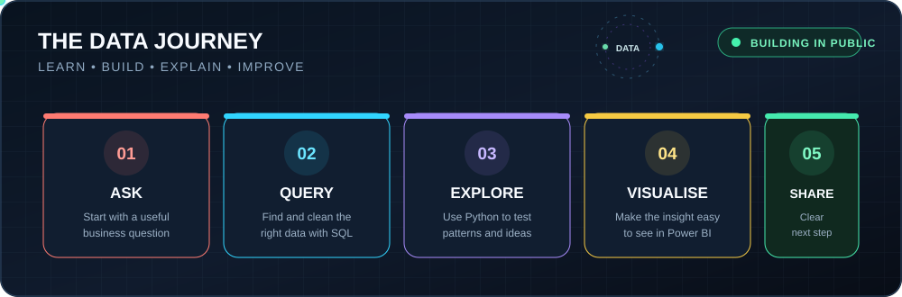
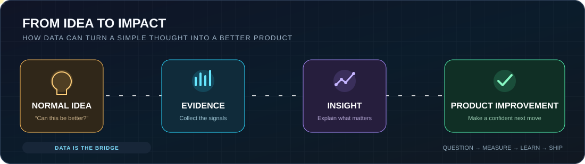
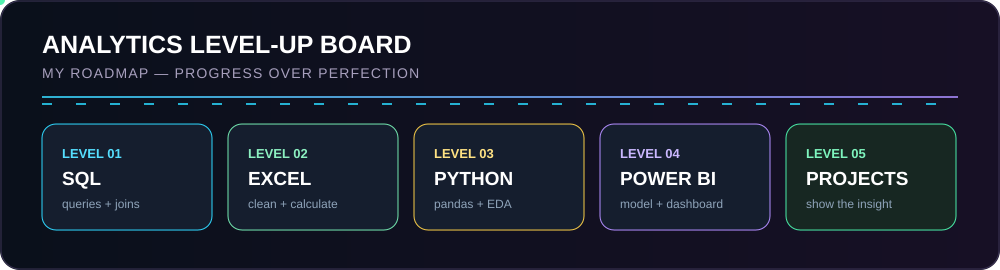
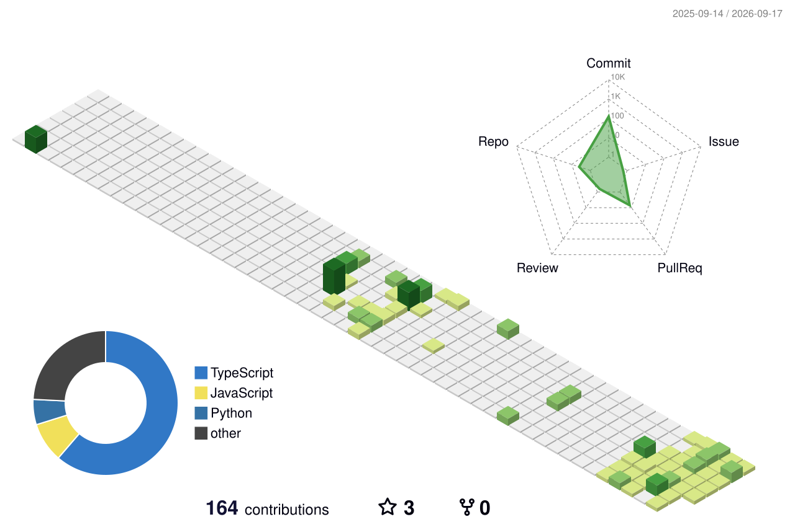
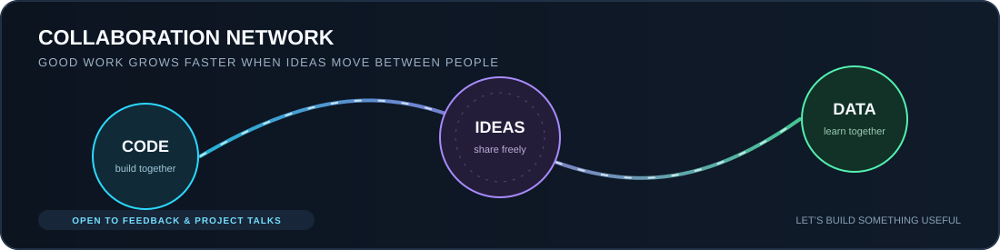

<!--
  GitHub Profile README - Chiranjeeb1101
  Role: Aspiring Data Analyst
  Focus: SQL, Python, Power BI, hands-on projects, and clear data storytelling
-->

  

  

<table>
  <tr>
    <td width="50%"></td>
    <td width="50%"></td>
  </tr>
  <tr>
    <td width="50%"></td>
    <td width="50%"></td>
  </tr>
</table>

  

##  About Me

Hi, I’m **Chiranjeeb**—a curious builder from **Bhubaneswar, India** who is moving from full-stack development into data analytics. I enjoy starting with a simple question, digging into the data, and sharing the answer in a way that makes sense to everyone.

Right now, I’m learning **SQL, Python, Excel, Power BI, and data storytelling** by building practical work in public. My [Data Analyst Journey](https://github.com/Chiranjeeb1101/Data-Analyst-Journey) is where I keep the roadmap, notes, and projects that come from that process.

> I’m not chasing perfect dashboards—I’m learning how to ask better questions and turn data into useful next steps.

  

---

##  My Analytics Journey

  

  

  

<table>
  <tr>
    <td width="50%">
      <strong>Learn by doing</strong> 
      I’m building the fundamentals with SQL, spreadsheets, statistics, and Python—using real datasets whenever possible.
    </td>
    <td width="50%">
      <strong>Share the process</strong> 
      Every topic becomes a small project: clean the data, answer one question, and explain the result visually.
    </td>
  </tr>
</table>

  

  

##  Tools I’m Building With

<table>
  <tr>
    <td align="center" width="120">
       <b>PostgreSQL</b>
    </td>
    <td align="center" width="120">
       <b>Python</b>
    </td>
    <td align="center" width="120">
       <b>Pandas</b>
    </td>
    <td align="center" width="120">
       <b>NumPy</b>
    </td>
    <td align="center" width="120">
       <b>MySQL</b>
    </td>
  </tr>
  <tr>
    <td align="center" width="120">
       <b>Power BI</b>
    </td>
    <td align="center" width="120">
       <b>Git</b>
    </td>
    <td align="center" width="120">
       <b>VS Code</b>
    </td>
    <td align="center" width="120">
       <b>Tableau</b>
    </td>
    <td align="center" width="120">
       <b>Excel</b>
    </td>
  </tr>
</table>

  

##  Current Focus

<table>
  <tr>
    <td width="50%" valign="top">
      <strong>Learning in public</strong> 
      I’m following a structured path through SQL, spreadsheets, Python, Power BI, and storytelling. Notes and progress live in <a href="https://github.com/Chiranjeeb1101/Data-Analyst-Journey">Data-Analyst-Journey</a>.
    </td>
    <td width="50%" valign="top">
      <strong>Building a useful portfolio</strong> 
      My aim is simple: make projects that begin with a real question, show the analysis clearly, and end with a practical recommendation.
    </td>
  </tr>
</table>

##  Featured Work

<table>
  <tr>
    <td width="62%">
      <h3><a href="https://github.com/Chiranjeeb1101/Data-Analyst-Journey">Data-Analyst-Journey</a></h3>
      
<em>My public roadmap for becoming a job-ready data analyst—one skill, project, and insight at a time.</em>

      <ul>
        <li><b>Foundation:</b> SQL, spreadsheets, Python, exploratory analysis, and data cleaning.</li>
        <li><b>Visualisation:</b> Power BI, Tableau, dashboard design, and KPI thinking.</li>
        <li><b>Portfolio:</b> projects that clearly show the question, method, finding, and recommendation.</li>
      </ul>
    </td>
    <td width="38%" align="center">
      <a href="https://github.com/Chiranjeeb1101/Data-Analyst-Journey">
          
          
        
      </a>
    </td>
  </tr>
</table>

###  What I’m Learning Next

  
<b>1. SQL & Database Analysis</b>

   
  <ul>
    <li>Joins, aggregations, subqueries, CTEs, and window functions.</li>
    <li>Business questions such as customer segments, retention, and funnel performance.</li>
    <li>Data validation and clear, consistent KPI definitions.</li>
  </ul>

  
<b>2. Python & Exploratory Analysis</b>

   
  <ul>
    <li>Pandas and NumPy for cleaning, transformation, and exploration.</li>
    <li>Distributions, correlations, outliers, and basic hypothesis testing.</li>
    <li>Turning observations into a concise, actionable explanation.</li>
  </ul>

  
<b>3. Power BI & Dashboard Design</b>

   
  <ul>
    <li>Data modelling, introductory DAX, and meaningful KPI measures.</li>
    <li>Dashboards with an intentional audience, hierarchy, and drill-down flow.</li>
    <li>Storytelling that makes the main takeaway easy to spot.</li>
  </ul>

  
<b>4. Business Problem Framing</b>

   
  <ul>
    <li>Starting with a clear business question before opening the dataset.</li>
    <li>Connecting an insight to a practical next step.</li>
    <li>Communicating assumptions, limitations, and confidence clearly.</li>
  </ul>

  

##  GitHub Activity

Your contribution graph updates automatically when you push new work to GitHub.

  

  
<b>View my 3D GitHub contribution calendar (Animated)</b>

   
  

    <picture>
      <source media="(prefers-color-scheme: dark)" srcset="./profile-3d-contrib/profile-green-animate.svg">
      <source media="(prefers-color-scheme: light)" srcset="./profile-3d-contrib/profile-green-animate.svg">
      
    </picture>
  

  

##  Connect & Collaborate

  

  <a href="https://github.com/Chiranjeeb1101">GitHub</a>
  &nbsp;•&nbsp;
  <a href="https://www.linkedin.com/in/chiranjeeb-kumar-sahoo/">LinkedIn</a>
  &nbsp;•&nbsp;
  <a href="mailto:chiranjeeb.dev@gmail.com?subject=Reaching%20Out%20From%20GitHub&body=Hi%20Chiranjeeb,%0D%0A%0D%0AI%20saw%20your%20GitHub%20profile%20and%20wanted%20to%20connect%20regarding...">Email</a>
  &nbsp;•&nbsp;
  <a href="https://github.com/Chiranjeeb1101/Data-Analyst-Journey">Data Analyst Journey</a>

  <i>"Turning curiosity into clear, actionable insights."</i>

